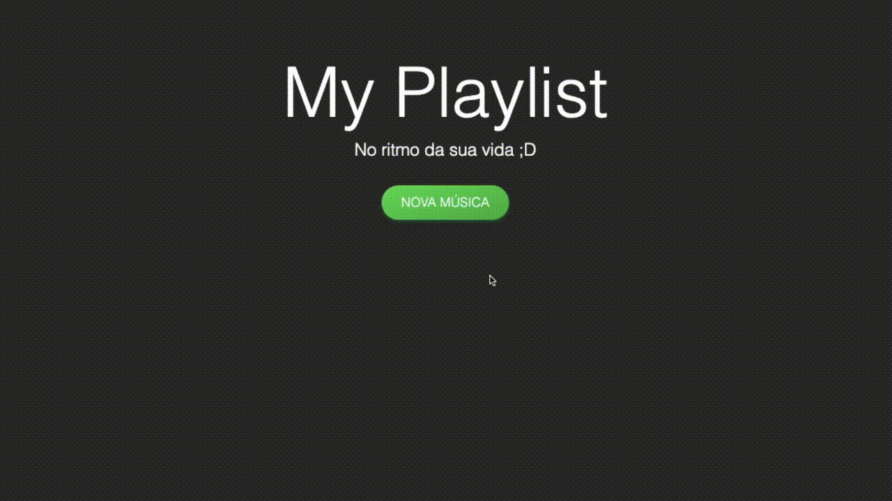

<p align="center">
    <a href="https://fabricadeprogramador.com.br/" target="blank">
        
    </a>
</p>

# Lista de Exercícios Vuejs 2

>Crie uma pasta chamada **​exercícios-vuejs**, caso já não tenha a criado, para os exercícios abaixo.

## 1) My Playlist


O objetvo é criar um aplicação para validar um cadastro de música dentro de uma playlist. Para esta atividade vamos limitar a uma playlist apenas, e vamos supor que ela já foi criada.


Crie uma pasta chamada **my-playlist** para esta atividade

### HTML
Você deve criar apenas um arquivo HTML, nele faça a instânciaçõa do Vue Root. Coloque a tag abaixo no final do corpo do HTML (antes da tag `</body>`)

```html 
<script src="https://cdn.jsdelivr.net/npm/vue"></script>
```

### CSS
Crie dois arquivos: `reset.css` e `style.css` e importe-os no seu HTML nessa ordem. Para o arquivos `reset.css` utilize o código abaixo: 

```css
* {
    box-sizing: border-box;
    font-family: sans-serif;
    margin: 0px;
    outline: none;
}
```

Paleta de cores: 

+ `Preto`: rgb(45, 45, 45);

+ `Verde`: rgb(0, 219, 95);

+ `Verde Escuro`: rgb(0, 178, 77);

+ `Vermelho`: rgb(255, 90, 90);


### Funcionalidades
A aplicação começa exibindo apenas o título, subtítulo e o botão "Nova Música". Ao clicar no botão "Nova Música" este deve ser escondido, e um formulário com três campos: "Nome da música", "Duração da música" e "Autor da música" e dois botões: "Salvar" e "Cancelar" devem ser exibidos. 

Ao clicar no botão "Salvar" a aplicação deve verificar se ele digitou todos os campos. Caso contrário, deve ser exibido uma mensagem de erro logo abaixo de cada input com erro.

Ao clicar no botão "Cancelar" os campos devem ser "Zerados" e as mensagens de erros também.

## Entrega
Você deve postar as suas atividades no GitHub em seu perfil público e enviar o link do repositório no Slack da turma.